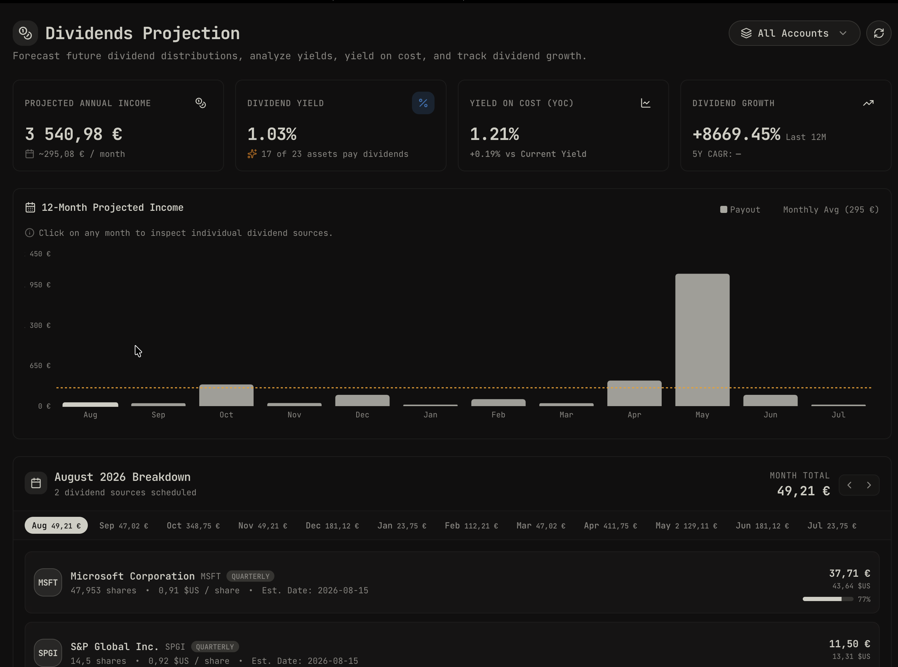

# Dividends Projection Addon for Wealthfolio

A Wealthfolio add-on providing interactive forward-looking dividend projections, portfolio dividend yield, yield on cost, multi-year dividend growth analysis (12-month and 5-year CAGR), and monthly income forecasting with source drill-downs.

## Features

- **Multi-Portfolio & Account Scope**: Seamlessly switch between All Accounts, Account Groups / Portfolios, or Individual Accounts.
- **KPI Metrics**:
  - Projected Annual Dividend Income (and monthly average)
  - Current Portfolio Dividend Yield (%)
  - Yield on Cost (YoC %)
  - 12-Month Dividend Growth (%)
  - 5-Year Compound Annual Dividend Growth (CAGR %)
  - Dividend Payer Coverage
- **12-Month Monthly Projection Chart**: Interactive bar chart forecasting payouts for the next 12 rolling months.
- **Month Drill-Down View**: Click any month to inspect all contributing dividend payments, shares owned, payout amounts, and % contribution.
- **Holdings Dividend Table**: Comprehensive table breakdown with sortable yields, yield on cost, frequency, payout months, and growth metrics.

## Overview

