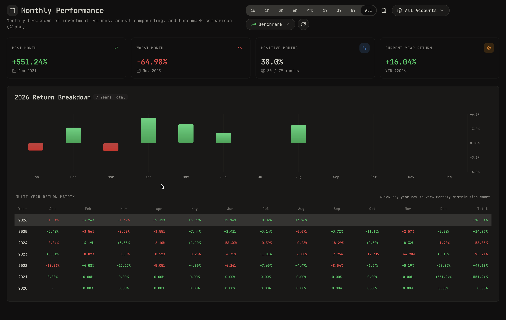

# Monthly Performance Addon for Wealthfolio

A powerful performance analysis addon for [Wealthfolio](https://wealthfolio.app).

## 🚀 Features

- **Multi-Year Monthly Return Matrix**: Interactive table showing returns for every month (Jan–Dec) and compounded annual/YTD returns.
- **Monthly Distribution Bar Chart**: Clean visual representation of returns with positive/negative color grading.
- **Benchmark Comparison & Alpha**: Compare your portfolio performance side-by-side with indices (S&P 500, MSCI World, Nasdaq 100) or any ticker symbol, and see your monthly excess return (Alpha).
- **Portfolio & Account Scope Filtering**: Switch between all portfolio accounts or focus on individual investment accounts.
- **Performance KPIs**: Instant overview of best month, worst month, positive months ratio (win rate), YTD return, and alpha.

## 📦 Installation in Wealthfolio

1. Download `monthly-performance-addon.zip` from the [Releases](https://github.com/thibaultserti/wealthfolio-addons/releases) page.
2. In Wealthfolio, navigate to **Settings > Addons**.
3. Click **Install from File** and select the `.zip` archive.
4. Enable the addon.

## 🛠️ Development

```bash
# Install dependencies
pnpm install

# Build the addon
pnpm run build

# Watch mode
pnpm run dev

# Run unit tests
pnpm test

# Package into .zip
pnpm run package
```

## Overview


