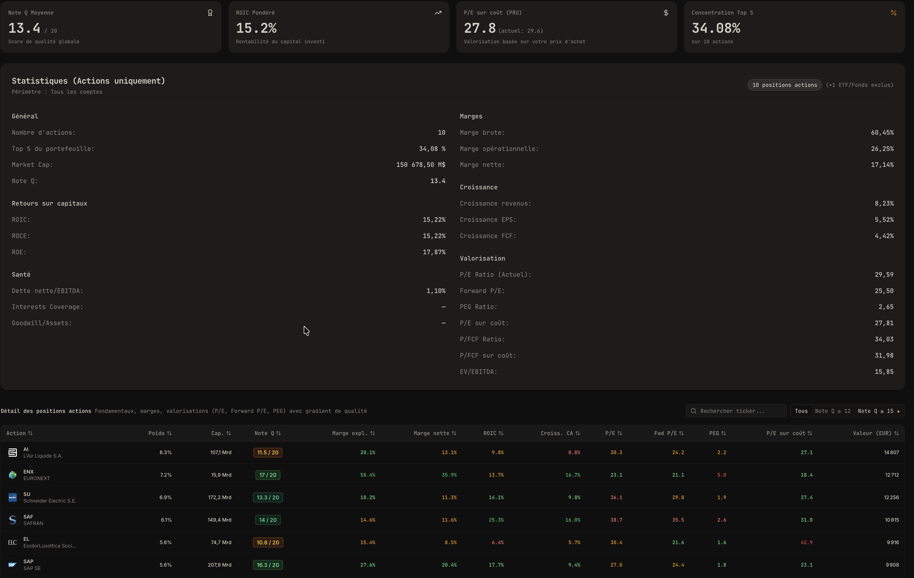

# Wealthfolio Portfolio Metrics Addon

An advanced financial & fundamental metrics addon for [Wealthfolio](https://wealthfolio.app).

## Features

- **General Statistics**: Stock count, Top 5 & Top 10 concentration %, Weighted Market Cap, and composite Quality Score (Note Q).
- **Margins Analysis**: Gross margin, Operating margin, Net profit margin with intuitive quality threshold progress gauges.
- **Returns on Capital**: ROIC (Return on Invested Capital), ROCE (Return on Capital Employed), ROE (Return on Equity).
- **Growth Indicators**: Revenue growth (YoY), EPS growth (YoY), Free Cash Flow (FCF) growth.
- **Financial Health**: Net Debt / EBITDA, Interest Coverage, Goodwill / Total Assets.
- **Valuation**: P/E Ratio, P/E on Cost (based on PRU/cost basis), P/FCF Ratio, P/FCF on Cost, EV/EBITDA.
- **Multi-Portfolio / Multi-Account Comparator**: Compare fundamental quality, margins, valuation, and health side-by-side across portfolios or accounts.
- **Holdings Breakdown**: In-depth table of each stock position with sorting, filtering, and quality score badges.

## License

MIT

## Overview

